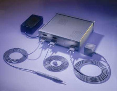

# Polhemus for C++

### Introduction

This package is a development library for C++ to use Polhemus Fastrak or Isotrak2 on IRIX and WIN32 platforms.



### Setup

To use the package, you have to make a library from following four source files at first.

```
polhemus.h, polhemus.cpp, serial.h, serial.cpp
```

Use the following compiler flags to create the library.

COMPILER FLAG | PURPOSE
---|---
WIN32 | Support for Windows9x//NT platform.
SGI | Support for IRIX.
ISOTRAK2 | Support for ISOTRAK2. If you don't use the flag, the library supports Fastrak.

### Class Overview

#### Polhemus Class

```
class CPolhemus : public CSerial
{
public:
  CPolhemus(char *device, int speed);
  ~CPolhemus();
  int GetActiveReceiverN(void)
  void GetPosition(int nReciver, Point3d p3Pos);
  void GetOrientation(int nReciver, Euler eOri);
};
```

#### CPolhemus(char \*device, int speed)

- device : Specifies a string of the serial port. You can use the platform independent defines SERIAL1 or SERIAL2 that are defined in "serial.h"
- speed : Specifies the baud rate that is a communication speed with a Polhemuse device.

The constructor creates an instance that is used to communicate with a Polhemus device.

#### int GetActiveReceiverN(void)

The method returns a number of active receivers.

#### void GetPosition(int nReceiver, Point3d p3Pos)

The method retrieves a current position of a specified active receiver. Point3d is typedefed as an array of 3 floats. The valid range of the nReciver is from 1 to the value returned by GetActiveReciverN().

#### void GetOrientation(int nReceiver, Euler eOri)

The method retrieves current euler angles of a specified active receiver. Euler is typedefed as an array of 3 floats. The valid range of the nReciver is from 1 to the value returned by GetActiveReciverN().

### Revision

Revision | Date | Note
---|---|---
1.0 | 1999/05/20 | The first release.

### License

This library is provided "AS IS". Licenser disclaims all warranties,
including but not limited to, all express or implied warranties of
merchant ability and fitness for a particular purpose. Everyone can use
the library for commerce or personal purposes free.
